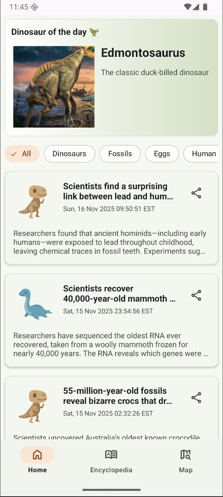
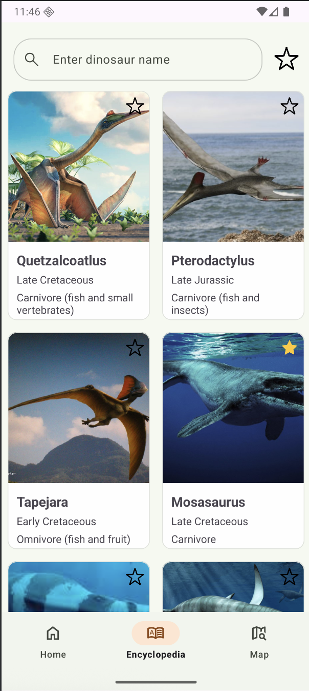
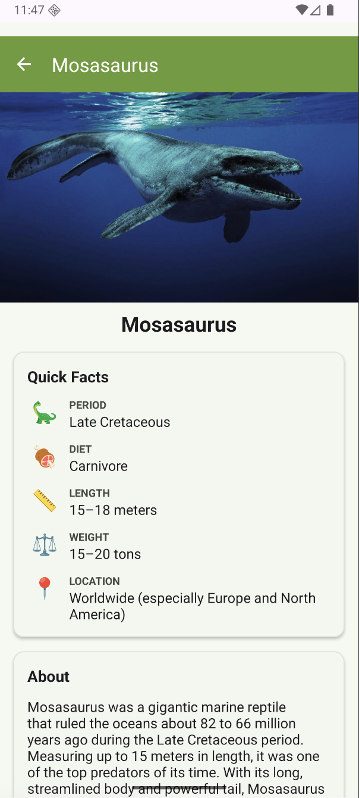
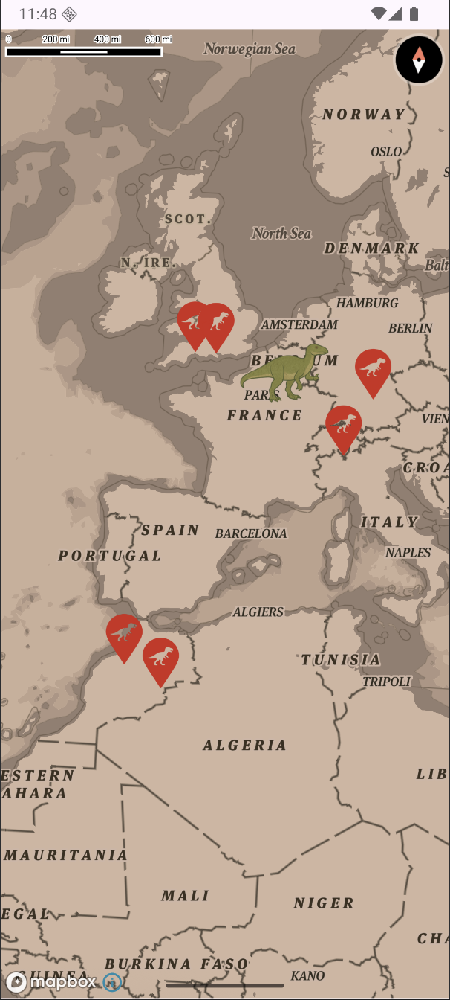
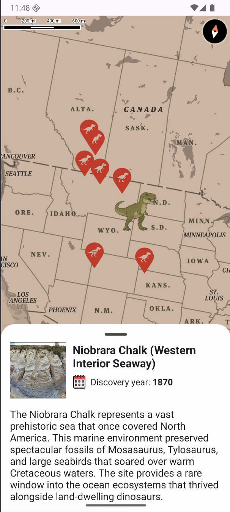

# 🦕 Dino Encyclopedia

Android application for exploring dinosaurs, paleontology news, and fossil discovery locations around the world.

## 📱 Screenshots

| Home                                 | Encyclopedia                                         | Details                                         |
|--------------------------------------|------------------------------------------------------|-------------------------------------------------|
|  |  |  |

| Map                                | Map with Info                                              | Onboarding                                       |
|------------------------------------|------------------------------------------------------------|--------------------------------------------------|
|  |  |  |

## 🛠 Tech Stack

### Core
- **Kotlin** - Primary language
- **UI** - XML Views
- **Navigation** - Fragments

### Dependency Injection
- **Koin** - Lightweight DI framework for managing dependencies across the app

### Networking & Data
- **Retrofit** - REST API client for fetching dinosaur data
- **OkHttp** - HTTP client with interceptors
- **Gson** - JSON serialization/deserialization
- **RSSParser** - Parsing RSS feeds for paleontology news articles

### Asynchronous Operations
- **RxJava 3** - Reactive programming for data streams and UI state management
- **RxAndroid** - Android-specific bindings for RxJava
- **RxKotlin** - Kotlin extensions for RxJava
- **Coroutines + RxJava Bridge** - Interoperability between Coroutines and RxJava

### Database
- **Room** - Local database with RxJava support
    - Caching dinosaurs data (24-hour cache)

### Background Tasks
- **WorkManager** - Scheduling periodic tasks
    - Daily dinosaur updates

### Maps
- **MapBox SDK** - Interactive world map
    - Displaying fossil discovery locations
    - Custom markers for paleontological sites
    - Decorative dinosaur stickers on continents
    - BottomSheet with location details

### UI/UX
- **Lottie** - Vector animations for onboarding
- **Coil** - Image loading and caching
- **DotsIndicator** - ViewPager page indicators for onboarding
- **SwipeRefreshLayout** - Pull-to-refresh functionality

## 📋 Features by Screen

### 🏠 Home Screen
- **Dinosaur of the Day** - Daily featured dinosaur (WorkManager + RxJava)
- **Paleontology News** - RSS feed integration with articles
- **Filter Chips** - Quick navigation to filtered encyclopedia content

### 📚 Encyclopedia Screen
- **Dinosaur List** - RecyclerView with all dinosaurs from API
- **Image Loading** - Coil for efficient image caching
- **Pull to Refresh** - SwipeRefreshLayout for manual data updates
- **Search & Filters** - Browse by period, diet, location

### 🦖 Dinosaur Details Screen
- **Detailed Information** - Complete dinosaur data
- **Room Caching** - 24-hour cache to reduce API calls
- **Retrofit + Room** - Online-first strategy with local fallback

### 🗺 Map Screen
- **MapBox Integration** - Interactive world map with Mercator projection
- **Location Markers** - 30+ fossil discovery sites worldwide
- **Dinosaur Stickers** - Decorative icons on continents
- **BottomSheet** - Location details with images and discovery information
- **Custom Styling** - Vintage atlas-inspired map theme

### 👋 Onboarding Screen
- **ViewPager2** - Swipeable introduction screens
- **Lottie Animations** - Smooth vector animations
- **DotsIndicator** - Page progress indicator